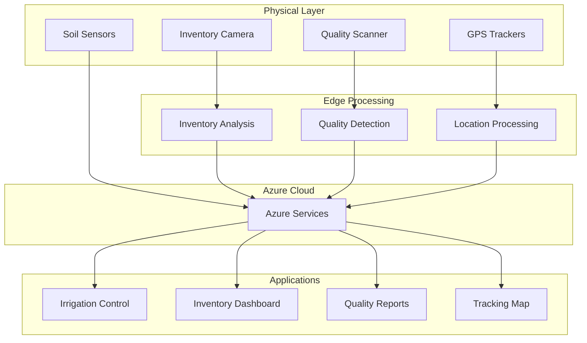

# Agriculture IoT Portfolio Suite 🚜

A collection of integrated IoT solutions for modern smart farming, demonstrating full-stack development capabilities from edge devices to cloud analytics.

## 📦 Projects Overview

| Project | Description | Technologies | Status |
|---------|-------------|--------------|--------|
| [**Inventory Management**](inventory-management/) | Real-time stock monitoring with computer vision | Python, React, Azure CV | ✅ Complete |
| [**Fruit Quality Detection**](quality-control/) | AI-powered fruit grading and quality control | Python, OpenCV, Azure ML | ✅ Complete |
| [**GPS Tracking System**](equipment-tracking/) | Real-time equipment tracking with geofencing | C#, Azure Maps, IoT Hub | ✅ Complete |
| [**Soil Monitoring**](environmental-monitoring/) | IoT soil sensors with automated analytics | Python, Azure Functions | ✅ Complete |

## 🏗️ Conceptual Architecture

## 🎯 Key Capabilities
- 🌾 Smart Inventory Management
  * Real-time object detection for stock monitoring
  * Automated placement validation
  * Predictive restocking alerts

- 🍎 Quality Control System
  * Computer vision-based fruit grading
  * Ripeness detection and classification
  * Quality trend analytics

- 🗺️ Equipment Tracking
  * Real-time GPS monitoring
  * Geofencing and security alerts
  * Maintenance scheduling
  * Path Reconstruction and Route Planning
 
- 🌧️ Environmental Monitoring
  * Soil moisture sensing
  * Automated irrigation recommendations
  * Micro-climate analytics
 
## 📊 Technical Highlights
- Edge Computing: On-device processing for real-time response

- Azure Integration: Cloud services for scalability and analytics

- Next Dashboards: Modern web interfaces for monitoring

- IoT Protocols: MQTT, HTTP, and custom communication stacks

- Computer Vision: Custom-trained models for agricultural specific tasks
