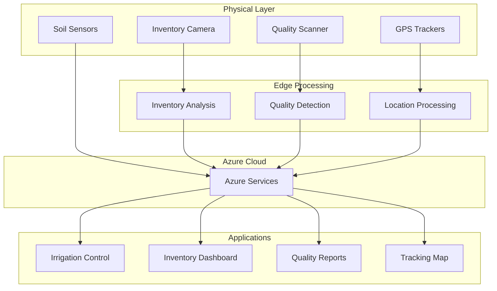

# Agriculture IoT Portfolio Suite 🚜

A collection of integrated IoT solutions for modern smart farming, demonstrating full-stack development capabilities from edge devices to cloud analytics.

## 🚀 Quick Navigation
- [Projects Overview](#projects-overview)
- [Architecture](#conceptual-architecture) 
- [Capabilities](#key-capabilities)
- [Technical Highlights](#technical-highlights)

## 📦 Projects Overview 

| Project | Description | Technologies | Status | Repository |
|---------|-------------|--------------|--------|------------|
| [**Inventory Management**](environmental-monitoring/) | Real-time stock monitoring with computer vision | Python,Custom Vision, Next, Azure CV, OpenCV | ✅ Complete | [View Code](https://github.com/iot-aicha/stock-counter.git) |
| [**Fruit Quality Detection**](quality-control/) | AI-powered fruit grading | Python, OpenCV, Azure ML, Custom Vision| ✅ Complete | [View Code](https://github.com/iot-aicha/fruit-quality-detector.git) |
| [**GPS Tracking System**](equipment-tracking/) | Equipment tracking with geofencing | Python, Azure Maps, IoT Hub, | ✅ Complete | [View Code](https://github.com/iot-aicha/gps-tracking-app.git) |
| [**Soil Monitoring**](environmental-monitoring/) | Soil sensors with analytics | Python, Azure Functions, Sensors | ✅ Complete | [View Code](https://github.com/iot-aicha/soil-moisture-iot.git) |

## 🏗️ Conceptual Architecture 

## 🎯 Key Capabilities 
- 🌾 Smart Inventory Management
  * Real-time object detection for stock monitoring
  * Automated placement validation
  * Predictive restocking alerts

- 🍎 Quality Control System
  * Computer vision-based fruit grading
  * Ripeness detection and classification
  * Quality trend analytics

- 🗺️ Equipment Tracking
  * Real-time GPS monitoring
  * Geofencing and security alerts
  * Maintenance scheduling
  * Path Reconstruction and Route Planning
 
- 🌧️ Environmental Monitoring
  * Soil moisture sensing
  * Automated irrigation recommendations
  * Micro-climate analytics
 
## 📊 Technical Highlights 
- Edge Computing: On-device processing for real-time response

- Azure Integration: Cloud services for scalability and analytics

- Next Dashboards: Modern web interfaces for monitoring

- IoT Protocols: MQTT, HTTP, and custom communication stacks

- Computer Vision: Custom-trained models for agricultural specific tasks
